# RobotStudio

RobotStudio is a didactic robotics and C#/.NET learning platform.

Version `1.0.0` delivers the first stable vertical slice: a generic three-axis Cartesian robot can be scripted, validated, simulated, inspected through CLI output, and visualized in a WPF desktop 3D viewer.

The project is intentionally educational. It is designed to help students understand both robotics concepts and software architecture: domain modeling, motion planning, deterministic simulation, scripting, UI boundaries, tests, and future hardware integration.

## What You Can Do Now

- Simulate a generic Cartesian robot with X/Y/Z axes.
- Validate physical axis limits for position, velocity, and acceleration.
- Run `HOME`, `MOVE`, and `WAIT` commands.
- Write simple DSL scripts such as:

```txt
HOME
MOVE X=120 Y=80 Z=40 SPEED=90
DRIVE X=160 Y=80 HEADING=45 LIN=120 ANG=90
SCARA SHOULDER=45 ELBOW=30 SPEED=80
ARM BASE=45 SHOULDER=30 ELBOW=-20 SPEED=80
WAIT 500
```

- Run the CLI to inspect commands, timeline steps, final state, and final position.
- Open the WPF desktop viewer to inspect the Cartesian robot in 3D.
- Open the first XY Plotter viewer as a beginner two-axis model.
- Open the first Differential Drive viewer for a beginner mobile-robot simulation.
- Open the first SCARA viewer for introductory articulated joint-space simulation.
- Open the first Simple Articulated Arm viewer for three-joint articulated robot lessons.
- Load local teaching examples from every available desktop viewer.
- Load and save `.robot` or `.txt` scripts in the desktop app.
- Use keyboard shortcuts for active viewer playback, frame stepping, validation, simulation, script files, zoom, and 3D camera controls.
- Read clearer validation summaries when scripts contain syntax errors, invalid arguments, or physical limit violations.
- Rotate, zoom, and reset the camera.
- Use manual jog buttons and a direct command console.
- Inspect playback frames, state, position, charts, planned path, workspace, TCP, and didactic tooltips.
- Export and validate playback snapshots as JSON.

## Current Release

Current stable version: `1.0.0`.

This release is stable for the first educational goal: simulate and inspect the first robot model without real hardware.

Implemented:

- domain model;
- Cartesian robot profile;
- motion planner;
- deterministic simulator;
- simple DSL;
- CLI workflow;
- desktop 3D viewer;
- robot catalog metadata;
- first XY Plotter domain, motion, and viewer path;
- Differential Drive domain, motion planner, deterministic simulator, and 2D viewer;
- SCARA domain, kinematics, motion planner, deterministic simulator, DSL support, playback sampler, and 3D viewer;
- Simple Articulated Arm domain, forward kinematics, motion planner, deterministic simulator, DSL support, playback sampler, and 3D viewer;
- shared desktop rendering helpers for orbit cameras, simple meshes, paths, and reachable workspaces;
- shared playback contracts for cross-family simulation summaries;
- local desktop teaching examples and selectors for available training viewers;
- playback snapshots;
- didactic overlays, charts, timeline, and tooltips;
- future boundaries for G-code and hardware.

Not implemented yet:

- real serial communication;
- Arduino or ESP32 firmware/protocols;
- G-code parser;
- additional robot visual simulations such as delta robots or drones.

## Run The Desktop App

Requirements:

- Windows;
- .NET SDK matching `global.json`.

From the repository root:

```bash
dotnet run --project src/RobotStudio.Desktop
```

The desktop app starts with a robot selection screen. `Cartesian Robot`, `XY Plotter`, `Differential Drive Robot`, `SCARA Robot`, and `Simple Articulated Arm` are available in the current development build.

## Portable CLI And Core

The WPF desktop viewer is Windows-only. The portable solution validates the CLI, domain, motion, simulation, scripting, hardware boundary, and their non-desktop tests on Windows, Linux, and macOS.

Build the portable solution:

```bash
dotnet build build/RobotStudio.Portable.slnx
```

Run portable tests:

```bash
dotnet test build/RobotStudio.Portable.slnx
```

Build a portable CLI release artifact:

```bash
powershell -ExecutionPolicy Bypass -File scripts/release/build-cli-artifact.ps1 -Version 1.0.0 -Runtime linux-x64
```

Supported initial CLI release runtimes:

- `win-x64`
- `linux-x64`
- `osx-x64`

## Preview

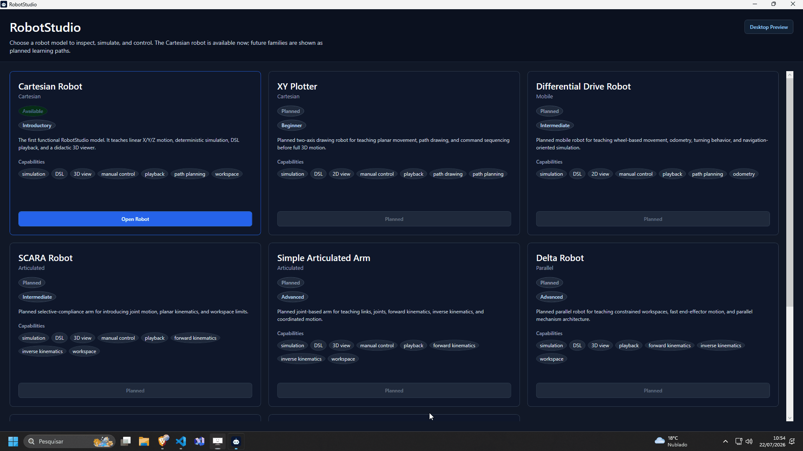

## Screenshots

### Robot Selection

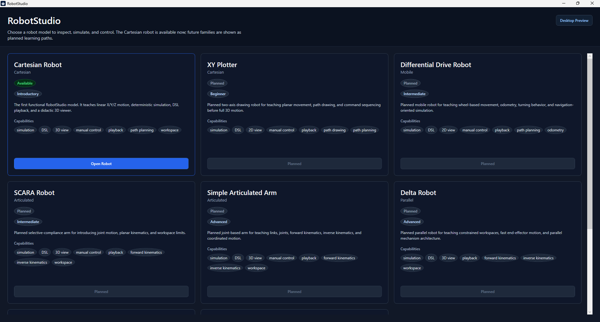

### Cartesian 3D Viewer

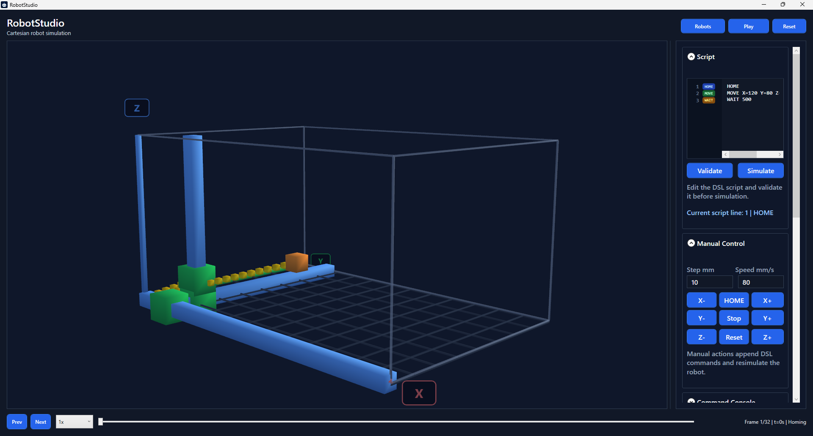

### Script And Manual Control

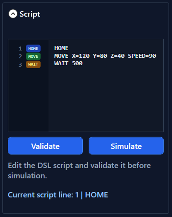

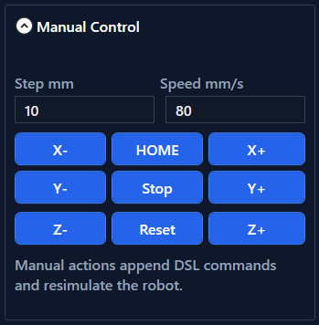

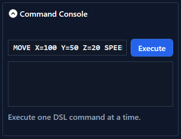

### Simulation State And Explanations

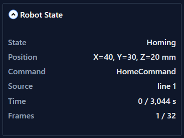

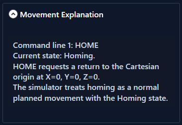

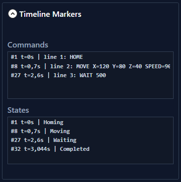

### Charts And Overlays

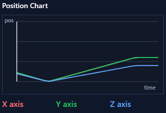

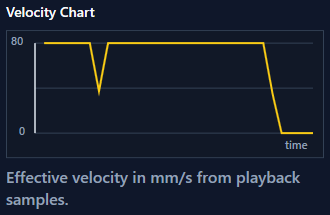

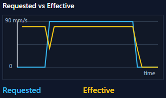

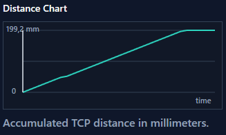

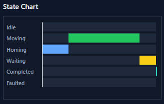

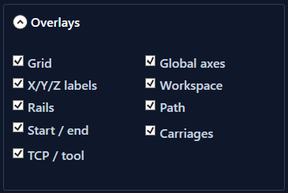

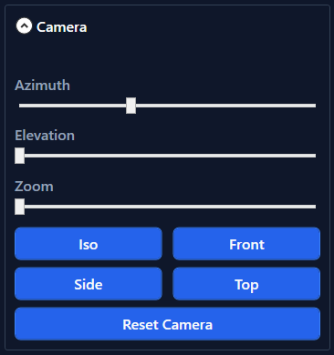

## Run The CLI

Run the built-in simulation example:

```bash
dotnet run --project src/RobotStudio.Cli
```

Other useful CLI commands:

```bash
dotnet run --project src/RobotStudio.Cli -- example
dotnet run --project src/RobotStudio.Cli -- validate examples/cartesian.robot
dotnet run --project src/RobotStudio.Cli -- simulate examples/cartesian.robot
dotnet run --project src/RobotStudio.Cli -- playback examples/cartesian.robot 500
dotnet run --project src/RobotStudio.Cli -- export-playback examples/cartesian.robot 500 playback.json
dotnet run --project src/RobotStudio.Cli -- validate-playback playback.json
```

## Build And Test

Build:

```bash
dotnet build
```

Run tests:

```bash
dotnet test
```

Check formatting:

```bash
dotnet format RobotStudio.slnx --verify-no-changes
```

## Build The Windows Installer

RobotStudio `1.0.0` is distributed as a Windows installer for the WPF desktop app.

```bash
powershell -ExecutionPolicy Bypass -File scripts/release/build-windows-installer.ps1 -Version 1.0.0 -Runtime win-x64
```

The installer is generated at:

```txt
artifacts/release/RobotStudio-1.0.0-win-x64-setup.exe
```

The release script also generates:

```txt
artifacts/release/RobotStudio-1.0.0-win-x64-setup.exe.sha256
```

When a version tag such as `v1.0.0` is pushed to GitHub, CI builds the Windows installer, builds portable CLI ZIP archives for Windows/Linux/macOS, and publishes a GitHub Release with all `.exe`, `.zip`, and `.sha256` assets attached.

## Project Structure

- `src/RobotStudio.Domain`: pure domain model for robot concepts, commands, state, contracts, domain errors, and the first Cartesian model.
- `src/RobotStudio.Motion`: simple motion planning based on domain types.
- `src/RobotStudio.Simulation`: deterministic command execution, sampling, playback snapshots, visual states, and scene frames.
- `src/RobotStudio.Scripting`: simple educational DSL exposed through a dialect contract prepared for future G-code.
- `src/RobotStudio.Hardware`: future hardware integration boundary contracts and planned prototype metadata.
- `src/RobotStudio.Cli`: terminal entry point for examples, validation, simulation, playback, and snapshot export.
- `src/RobotStudio.Desktop`: WPF desktop app for robot selection and visual robot simulation.
- `tests`: xUnit test projects for domain, motion, simulation, scripting, hardware boundaries, and desktop metadata/tooling.
- `docs`: product, architecture, use case, testing, CI, and user documentation.

## Documentation

- [Changelog](CHANGELOG.md)
- [Documentation Index](docs/README.md)
- [Technical Decisions](docs/technical-decisions.md)
- [Use Cases](docs/use-cases.md)
- [Test Map](docs/test-map.md)
- [User Guide](docs/user-guide.md)
- [Continuous Integration](docs/ci.md)
- [Contributing](CONTRIBUTING.md)
- [Code of Conduct](CODE_OF_CONDUCT.md)
- [Security Policy](SECURITY.md)

## License

RobotStudio is proprietary software. Personal, non-commercial study use is allowed under the [RobotStudio Personal Study License](LICENSE).

Commercial, business, organizational, institutional, brand-related, redistribution, sublicensing, and public hosting uses are not allowed without prior written permission from the copyright holder.
